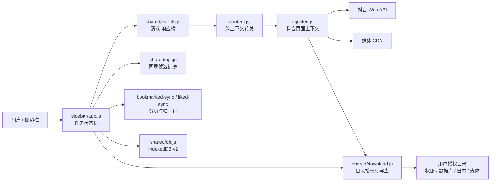
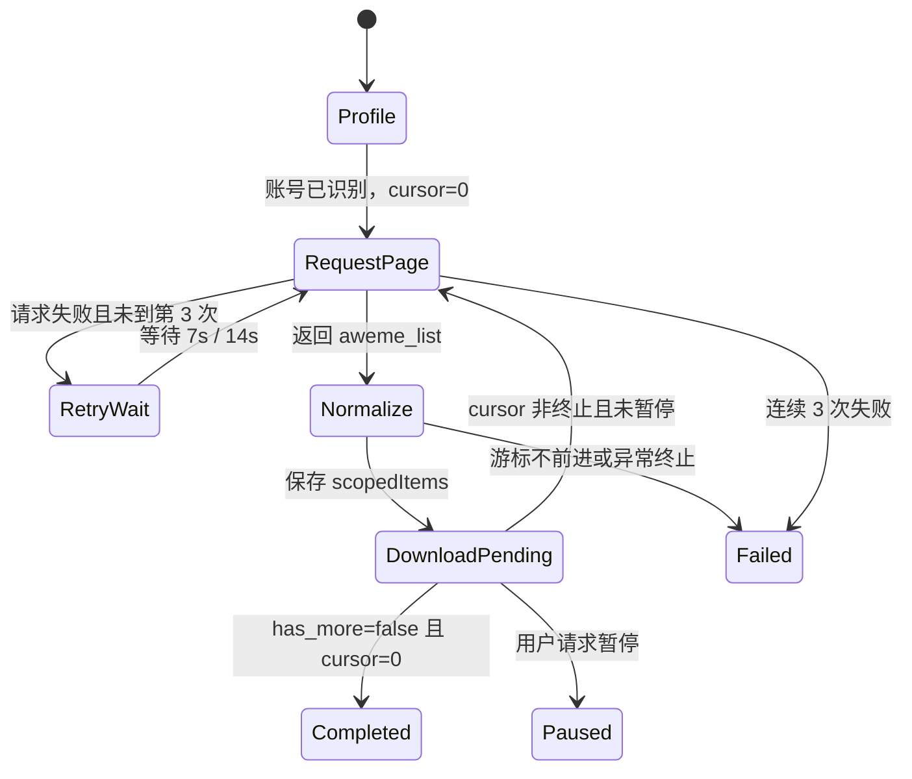

# 架构设计：列表扫描、最高画质下载与断点续跑

## 1. 设计目标

本设计支撑喜欢、收藏和其他来源的统一下载，并保持三条边界：

- 抖音账号态相关请求在页面上下文执行。
- 调度、状态机、日志和 UI 在扩展侧边栏执行。
- 续跑真相同时落在浏览器 IndexedDB 和用户文件夹，其中目标文件夹记录优先。

收藏列表的获取方式参考经授权分析的扩展行为；视频画质选择、下载、校验和本地状态由本项目自己的实现负责。

## 2. 组件图



## 3. 组件职责

### 3.1 `content.js`

- 创建扩展 iframe 和页面注入脚本。
- 只转发协议内消息，不实现业务状态机。
- 等待 iframe 可用后再发送页面结果，避免启动竞态。

### 3.2 `injected.js`

- 使用页面登录态构造公共 Web 参数。
- 实现 `GET_SELF_PROFILE`、`FETCH_LIKED_PAGE`、`FETCH_BOOKMARKED_PAGE`、`FETCH_AWEME_DETAIL`、`PRECHECK_URL` 和 `DOWNLOAD_TO_FOLDER`。
- 收藏列表按表单 POST 发起。
- 媒体下载尽量在页面上下文完成，以降低扩展 iframe 直接访问 CDN 的跨域失败率。

### 3.3 `sidebar/app.js`

- 绑定按钮、显示状态、记录北京时间日志。
- 编排喜欢和收藏的“扫描一页、归一化、跳过、下载、持久化”循环。
- 管理暂停、连续失败保险、账号隔离和继续下载入口。
- 每个作品调用统一的 `downloadOne`，不同来源共享同一套最高画质和校验逻辑。

### 3.4 `liked-sync.js` 与 `bookmarked-sync.js`

- 解析当前用户和预计总数。
- 封装分页状态，防止 UI 层散落游标判断。
- 将 API aweme 归一化为本地 item。
- 只合并同一作用域的历史 item，避免喜欢和收藏互相继承下载状态。

### 3.5 `shared/api.js`

- 汇集并去重视频候选。
- 计算普通兼容排序和最高画质排序。
- 生成可写入日志的 codec、分辨率、fps、码率和大小描述。

### 3.6 `shared/db.js`

- 保存 `config`、`scopedItems`、`logs`、`runs` 和 `downloadJobs`。
- DB v2 新增 `scopedItems`，主键为 `itemKey`。
- 对外的 `getAll("items")`、`putItems` 和 `clearItems` 已透明切到 `scopedItems`。
- 从 v1 升级时，把 legacy `items` 按作用域迁移到 `scopedItems`。

### 3.7 `shared/download.js`

- 保存和恢复 `FileSystemDirectoryHandle`。
- 请求 `readwrite` 权限。
- 创建子目录和文件，写入 Blob 或文本。
- 仅在显式允许的兼容路径中使用浏览器 downloads；当前主下载入口要求文件夹优先。

### 3.8 `download-record.js`

- 从目标文件夹 `download-state.json` 恢复已下载状态。
- 匹配键是 `source + awemeId`。
- 记录没有 source 时，使用当前下载 scope 作为 `defaultSource`。

## 4. 消息协议

| 消息 | 方向 | 请求关键字段 | 返回关键字段 |
| --- | --- | --- | --- |
| `GET_SELF_PROFILE` | sidebar → page | 无 | user、状态码 |
| `FETCH_LIKED_PAGE` | sidebar → page | secUid、maxCursor、minCursor、count | awemeList、hasMore、游标 |
| `FETCH_BOOKMARKED_PAGE` | sidebar → page | cursor、count | awemeList、hasMore、cursor、total |
| `FETCH_AWEME_DETAIL` | sidebar → page | awemeId | aweme、coverUrl |
| `PRECHECK_URL` | sidebar → page | url、expected | HTTP、MIME、长度 |
| `DOWNLOAD_TO_FOLDER` | sidebar → page | rootHandle、relativePath、url | 写入大小和校验结果 |

消息必须携带 `requestId`。未知 type 返回错误；单个业务分支处理后立即 `return`，避免消息落入其他分支。

## 5. 收藏分页状态机

状态字段：

| 字段 | 含义 |
| --- | --- |
| cursor | 下一页请求游标 |
| hasMore | API 的 `has_more` 布尔值 |
| page | 已完成页数 |
| checked | 已归一化的视频数量 |
| rawChecked | API 返回的原始作品数量 |
| expectedTotal | 用户资料或响应中的预计收藏数 |
| seenIds | 本轮扫描内的 awemeId 去重集合 |
| finished | 当前游标是否为终止形态 |
| fullScan | 是否满足 `has_more=false && cursor=0` |



关键不变量：

- 每次新任务从 `cursor=0` 扫描。
- `has_more` 不能单独决定结束；cursor 也必须可信。
- `expectedTotal` 只用于展示和空响应保护，不用于提前截断。
- `seenIds` 只在当前扫描有效；跨任务幂等由 `scopedItems` 和文件夹记录负责。
- 页面最小间隔 3 秒，重试等待不替代该间隔。

## 6. Item 状态模型

```text
itemKey = normalizeScope(source) + ":" + awemeId
normalizeScope("favorite_api") = "liked"
normalizeScope("bookmarked") = "bookmarked"
```

同一作品可以有两条记录：

```text
liked:765...
bookmarked:765...
```

两条记录可以有不同的 `downloadStatus`、路径、失败原因和更新时间。

| 字段 | 常见值 | 说明 |
| --- | --- | --- |
| source | liked、favorite_api、bookmarked、following | 数据来源 |
| status | pending、favorited、already_favorited 等 | 收藏业务状态 |
| downloadStatus | not_started、downloading、downloaded、failed | 下载状态 |
| lastError | 文本 | 最后失败原因 |
| downloadQualityLabel | 例如 h265 1440x2560 | 最终画质摘要 |
| downloadVideoPath | 相对路径 | 目标目录中的视频路径 |

收藏列表归一化时强制 `source=bookmarked`、`status=already_favorited`、`collectStat=1`；只从已有 bookmarked 记录继承下载状态。

## 7. 最高画质选择

候选来源：

1. `video.bit_rate[*].play_addr.url_list`。
2. `video.play_addr_h264`。
3. `video.play_addr_h265`。
4. `video.play_addr`。

去重键包含 URL、codec、分辨率、码率、大小和来源。

最高画质排序：像素面积、码率、大小、fps、H.265 小幅加权、`qualityType`。普通模式先给 H.264 极高优先级，再比较相同画质字段。

文件夹模式下载：

1. 列表归一化时预先计算最高画质候选、普通兼容 fallback 和候选时间戳。
2. 下载时若候选不超过 10 分钟，直接复用；缺失、过期或需补封面时才请求作品详情。
3. 合并普通兼容 fallback，按 URL 去重。
4. 最高画质最多尝试前 4 个候选；普通模式只尝试 1 个。
5. 每个候选只 fetch 一次，在同一次响应中完成状态、MIME、长度和 Blob 校验，再写入目标路径。
6. 成功后记录实际候选，而不是最初候选。
7. 全部候选失败才把作品标记 `failed`。

这套逻辑由 `downloadOne` 统一调用，liked 与 bookmarked 不得各自实现画质分支。

## 8. 写盘与恢复

### 8.1 写盘时机

- 任务开始写 `download-state.json`。
- 单条作品成功或失败后立即更新 `download-state.json`，保证断点可恢复。
- HTML、五个汇总数据库和完整日志每 10 条或 30 秒刷新一次，避免每条重写全部资产。
- 用户暂停、完整扫描结束和外层收尾时强制完整刷新。
- `performance-summary.json` 在完整刷新及任务最终收尾时写入。

媒体写入成功后，item 才更新为 `downloaded`。

### 8.2 文件夹记录优先级

继续下载 scope 的解析顺序：

1. 已授权文件夹 `download-state.json` 的 `current.scope`。
2. IndexedDB `config.lastDownloadScope`。
3. 默认 `liked`。

恢复时，用文件夹 `record.items` 与当前 `scopedItems` 做复合键匹配。文件夹记录属于其他 uid 时拒绝恢复和写入。

### 8.3 为什么从第一页继续

远端列表会新增、删除、重排，分页 cursor 也可能过期。保存 cursor 并从中间恢复可能漏掉新内容。因此继续下载使用“从第一页重新对账 + 本地 downloaded 幂等跳过”。

## 9. 文件与数据契约
### 8.4 性能可观测性

`shared/performance.js` 保存当前任务的阶段样本并生成汇总。sidebar 只持有单个活动 tracker；任务结束后转为只读的最后汇总。

核心阶段：

- `profile_api`：官方喜欢/收藏总数请求。
- `list_api`、`list_throttle_wait`、`list_retry_wait`：列表接口与主动限流。
- `detail_api`、`download_candidates_reused`：详情请求与候选复用。
- `video_request`、`video_transfer`、`video_write`：媒体首包、Blob 传输、文件写入。
- `checkpoint_write`、`artifact_full_write`：轻量续跑状态与重型汇总资产。
- `item_delay`、`ui_render`：条目间保护等待与 UI 开销。

汇总按阶段输出 count、total、average、P50、P95、max、failures。传输阶段额外聚合 bytes 和 MB/s。按 total 排序的前五项是当前任务瓶颈；主动等待与网络耗时必须分开解释，不能把限流等待误判为网速。

侧边栏首次打开只调用一次 `GET_SELF_PROFILE` 获取 `favoriting_count` 和收藏统计字段，因此总数显示速度不依赖完整列表扫描。官方总数、已扫描数和已下载数是三个不同语义。


`download-state.json` 至少包含：

- `generatedAt`。
- `likedTotal`、`bookmarkedTotal`。
- `downloadedTotal`、`pendingTotal`、`failedTotal`。
- `current.scope`、index、awemeId、resolution、phase、completed、total。
- `items[]`，包含 source、downloadStatus、路径、画质和错误。

`db_likes.json` 与 `db_bookmarked.json` 分开保存 ID 集合；`db_videos.json` 保存媒体路径和画质；`db_texts.json` 保存描述；`db_authors.json` 保存作者摘要。

单条 manifest 当前只以 awemeId 命名，未包含 scope。未来若不同 scope 需要不同 manifest 内容，必须先升级路径契约或定义合并规则。

## 10. 失败策略

| 失败 | 当前处理 |
| --- | --- |
| 未登录或资料无账号标识 | 停止并显示登录态错误 |
| 收藏页请求失败 | 最多 3 次，等待 7s / 14s |
| 游标不前进 | 立即停止，记录 cursor |
| 预计总数大于 0 但扫描为 0 | 停止，提示验证码或登录态 |
| 图文作品 | 跳过并计数 |
| 媒体候选无 MP4 或为空 | 尝试下一候选，最终失败落盘 |
| 文件夹权限失效 | 请求权限；仍失败则停止 |
| 文件夹账号不匹配 | 停止，要求选择新目录 |
| 连续 8 个作品下载失败 | 熔断停止 |
| 用户暂停 | 安全点保存后返回 |

## 11. 扩展规则

- 新列表来源必须新增明确 scope，不能复用 liked 键空间。
- 新分页协议必须放入独立 sync 模块并有纯状态机测试。
- 新媒体来源必须进入 `pickVideoCandidates`，不能绕开统一排序和日志。
- 改变文件路径或 `download-state` 字段必须说明兼容和迁移。
- API 变更必须同步更新 `injected.js`、运行时测试和访问面文档。
- 所有新入口必须定义继续、暂停、账号隔离和空响应语义。
